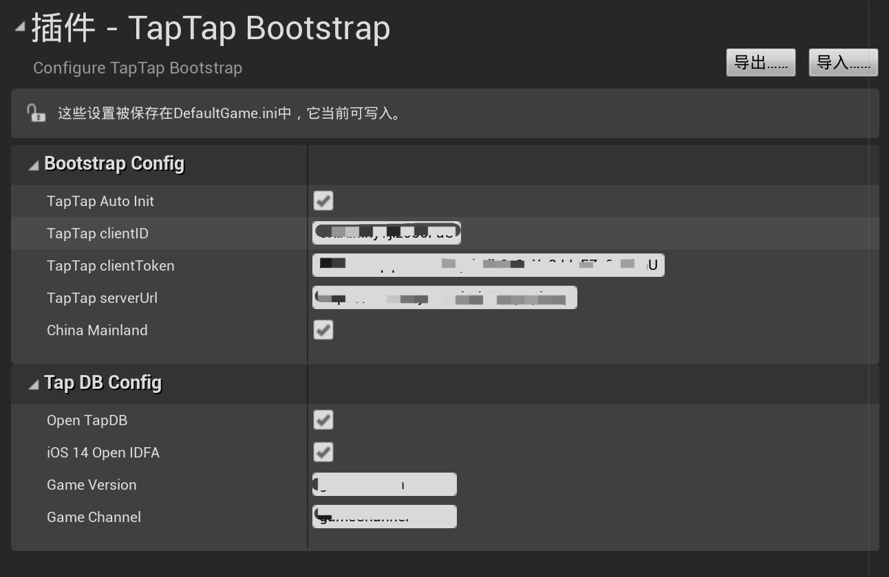

# TapSDK2-UE 

## 支持平台

* Android
* iOS

## 前提条件

* 安装 **UE 4.25** 及以上版本

* IOS **10** 或更高版本

* Android MinSDK 为**API21** 或更高版本

### 1.安装插件

* 下载 **TapSDK.zip** 解压后按需将所需模块的文件夹 Copy 到项目的 Plugins 目录中

#### 1.1 启用 TapSDK 插件

为了启用 TapSDK 插件，需要执行以下步骤

* 重启 Unreal Editor
* 打开 编辑 > 插件 > 项目 > TapTap 中开启所需模块
* 打开 编辑 > 项目设置，在 TapTap Bootstrap 目录下添加配置参数。
    * TapTap Auto Init：可选。是否开启 Bootstrap 自动初始化。
    * TapTap ClientId：必填，对应 **开发者中心 > 你的游戏 > 游戏服务 > 应用配置 > Client ID**。
    * TapTap ClientToken：必填，对应 **开发者中心 > 你的游戏 > 游戏服务 > 应用配置 > Client Token**。
    * TapTap serverUrl：必填，游戏的 [API 域名](https://developer.taptap.com/docs/sdk/start/get-ready/#%E7%BB%91%E5%AE%9A-api-%E5%9F%9F%E5%90%8D)，对应 **开发者中心 > 你的游戏 > 游戏服务 > 应用配置 > 域名配置 > API**。
    * China Mainland: 必填，游戏的[适用地区](https://developer.taptap.com/docs/sdk/start/get-ready/#%E9%80%82%E7%94%A8%E5%9C%B0%E5%8C%BA)，用于区分是否是中国大陆。
    * Open TapDB：可选。是否开启 TapDB，开启后才能配置以下选项。
        * iOS 14 Open IDFA: 可选。是否在 iOS 14+ 获取 IDFA。
        * Game Version: 可选。游戏版本号。
        * Game Channel: 可选。游戏渠道。




#### 1.2 iOS 配置

##### 1.2.1 Plist 配置

在 项目设置 > Platform > iOS > Additional Plist data 中可以填入一个字符串，复制以下代码并且替换其中的 `ClientId` 以及授权文案。

⚠️ 注意 `<string>tt{ClientId}</string>` 中的 `tt` 要保留，仅替换 `{ClientId}` 为游戏在开发者中心应用配置中的 Client ID。

```xml
<key>CFBundleURLTypes</key>
    <array>
        <dict>
            <key>CFBundleTypeRole</key>
            <string>Editor</string>
            <key>CFBundleURLName</key>
            <string>taptap</string>
            <key>CFBundleURLSchemes</key>
            <array>
                <string>tt{ClientId}</string>
            </array>
        </dict>
    </array>
<key>LSApplicationQueriesSchemes</key>
<array>
    <string>tapiosdk</string>
    <string>tapsdk</string>
</array>
<key>NSPhotoLibraryUsageDescription</key>
<string>{相册权限申请文案}</string>
<key>NSCameraUsageDescription</key>
<string>{相机权限申请文案}</string>
<key>NSMicrophoneUsageDescription</key>
<string>{麦克风权限申请文案}</string>
<key>NSUserTrackingUsageDescription<key>
<string>{数据追踪权限申请文案} </string>
```

权限描述

> NSPhotoLibraryUsageDescription: 相册权限，用于内嵌动态

> NSCameraUsageDescription: 相机权限，用于内嵌动态

> NSMicrophoneUsageDescription: 麦克风权限，用于内嵌动态 

> NSUserTrackingUsageDescription: 数据追踪，用于 TapDB

### 2.如何使用 TapSDK

> TapSDK 接口支持 C++ 以及蓝图两种方式，且统一通过 UE4 的多播委托来实现回调。详细介绍请看 2.1.1 登陆接口。

在 **Project.Build.cs** 中添加所需模块:
```c#
PublicDependencyModuleNames.AddRange(new string[] { "Core", "CoreUObject", "Engine", "InputCore" ,"TapCommon","TapBootstrap","TapLogin","TapDB","TapMoment","TapFriends","TapLicense"});
```

#### 2.1 TapBootstrap 启动器

TapBootstrap 用于 TapSDK 中的登陆、用户信息获取、篝火测试等功能

```c++
#include "TapBootstrap.h"
#include "TapBootstrapBPLibrary.h"
```

##### 2.1.1 登陆

在你使用 TapTap 登陆时调用以下接口:

```c++
/**
 * 调用 TapTap 登陆
 * @param permissions 登陆权限
 */
UFUNCTION(BlueprintCallable, meta = (DisplayName = "Login by TapTap"), Category = "TapBootstrap")
static void Login(TArray<FString> permissions);
```

TapTap 登陆提供以下几种委托用于接口登陆回调

```c++
// 登陆成功
DECLARE_MULTICAST_DELEGATE_OneParam(FLoginSuccess, const FTapAccessToken);

// 登陆失败
DECLARE_MULTICAST_DELEGATE_OneParam(FLoginError, const FTapError);

// 登陆取消
DECLARE_MULTICAST_DELEGATE(FLoginCancel);

UPROPERTY(BlueprintAssignable, Category = "TapBootstrap")
static FLoginSuccess OnLoginSuccess;

UPROPERTY(BlueprintAssignable, Category = "TapBootstrap")
static FLoginError OnLoginError;

UPROPERTY(BlueprintAssignable, Category = "TapBootstrap")
static FLoginCancel OnLoginCancel;

```

你需要在你的头文件中定义接口用于绑定以上几种委托
```c++
void OnLoginSuccess(const FTapUser token);

void OnLoginError(const FTapError error);

void OnLoginCancel();
```

接下来，你需要和 TapBootstrapModule 绑定以上定义的接口,这样就能收到 TapBootstrap 登陆接口的回调。
```c++
FTapBootstrapModule::OnLoginSuccess.AddUbObject(this,&YourObject::OnLoginSuccess);
FTapBootstrapModule::OnLoginError.AddUbObject(this,&YourObject::OnLoginError);
FTapBootstrapModule::OnLoginCancel.AddUbObject(this,&YourObject::OnLoginCancel);
```

##### 2.1.2 退出登陆

```c++
// 接口定义
UFUNCTION(BlueprintCallable, meta = (DisplayName = "TapTap Logout"), Category = "TapBootstrap")
static void Logout();

// 委托定义
DECLARE_MULTICAST_DELEGATE_OneParam(FLogout, const FTapError);

UPROPERTY(BlueprintAssignable, Category = "TapBootstrap")
static FLogout OnLogout;

```

##### 2.1.3 获取 TapTap Token

```c++        
// 导入头文件
#include "TapAccessToken.h"

// 接口定义
UFUNCTION(BlueprintCallable, meta = (DisplayName = "Get TapTap AccessToken"), Category = "TapBootstrap")
static void GetAccessToken();

// 委托定义
DECLARE_MULTICAST_DELEGATE_OneParam(FGetAccessToken, const FTapAccessToken);
    
UPROPERTY(BlueprintAssignable, Category = "TapBootstrap")
static FGetAccessToken OnGetAccessToken;

```

##### 2.1.4 获取 TapTap 用户信息

```c++
// 导入头文件
#include "TapUser.h"

// 接口定义
UFUNCTION(BlueprintCallable, meta = (DisplayName = "Get TapTap Userinfo"), Category = "TapBootstrap")
static void GetUser();

// 获取用户信息成功
DECLARE_MULTICAST_DELEGATE_OneParam(FGetUserSuccess,const FTapUser);

// 获取用户信息失败
DECLARE_MULTICAST_DELEGATE_OneParam(FGetUserError,const FTapError);

UPROPERTY(BlueprintAssignable, Category = "TapBootstrap")
static FGetUserSuccess OnGetUserSuccess;

UPROPERTY(BlueprintAssignable,Category = "TapBootstrap")
static FGetUserError OnGetUserError;

```

##### 2.1.5 获取 TapTap 详细用户信息

```c++
#include "TapUserDetail.h"

UFUNCTION(BlueprintCallable, meta = (DisplayName = "Get TapTap Detail Userinfo"), Category = "TapBootstrap")
static void GetDetailUser();

// 获取用户信息成功
DECLARE_MULTICAST_DELEGATE_OneParam(FGetUserDetailSuccess, const FTapUserDetail);

// 获取用户信息失败
DECLARE_MULTICAST_DELEGATE_OneParam(FGetUserDetailError, const FTapError);

UPROPERTY(BlueprintAssignable, Category = "TapBootstrap")
static FGetUserDetailSuccess OnGetUserDetailSuccess;

UPROPERTY(BlueprintAssignable, Category = "TapBootstrap")
static FGetUserDetailError OnGetUserDetailError;
```

##### 2.1.6 获取篝火测试资格

```c++
UFUNCTION(BlueprintCallable,meta = (DisplayName = "TapTap Test Qualification"), Category = "TapBootstrap")
static void GetTestQualification();

// 获取篝火测试资格结果 成功 true 具备测试资格 false 不具备测试资格
DECLARE_MULTICAST_DELEGATE_OneParam(FGetTestQualification, const bool);

// 获取篝火测试资格失败
DECLARE_MULTICAST_DELEGATE_OneParam(FGetTestQualificationError, const FTapError);

UPROPERTY(BlueprintAssignable, Category = "TapBootstrap")
static FGetTestQualification OnGetTestQualification;

UPROPERTY(BlueprintAssignable, Category = "TapBootstrap")
static FGetTestQualificationError OnGetTestQualificationError;
```

##### 2.1.7 设置语言

```c++
UFUNCTION(BlueprintCallable, meta = (DisplayName = "TapTap Language config"), Category = "TapBootstrap")
static void SetPreferLanguage(FTapLanguage language);
```

#### 2.2 TapDB 数据分析

```c++
#include "TapDB.h"
#include "TapDBBPLibrary.h"
```

##### 2.2.1 初始化 TapDB

>  TapDB 初始化可以通过 Unreal Editor 中的 TapTap Bootstrap 进行配置，也可以通过调用接口来进行初始化。

```c++
/**
 *
 * @param clientID TapTap client ID
 * @param channel 游戏渠道
 * @param gameVersion 游戏版本
 * @param isCN 是否是中国大陆
 */ 
UFUNCTION(BlueprintCallable,Category = "TapDB")
static void Init(FString clientID,FString channel,FString gameVersion,bool isCN);
```

##### 2.2.2 设置用户

```c++
/**
 * @param userId  用户id
 */ 
UFUNCTION(BlueprintCallable,Category = "TapDB")
static void SetUser(FString userId);

/**
 * 设置 UserId 以及 登陆类型
 * @param userId 用户 ID
 * @param loginType 登陆类型
 */
UFUNCTION(BlueprintCallable,Category = "TapDB")
static void SetUserWithLoginType(FString userId,FString loginType);
```

##### 2.2.3 设置 Name

```c++
/**
 * @param name 用户 name
 */
UFUNCTION(BlueprintCallable,Category = "TapDB")
static void SetName(FString name);
```

##### 2.2.4 设置等级

```c++
/**
 * @param level 等级
 */
UFUNCTION(BlueprintCallable,Category = "TapDB")
static void SetLevel(int level);
```
##### 2.2.5 设置服务
```c++
/**
 * @param server 服务地址
 */
UFUNCTION(BlueprintCallable,Category = "TapDB")
static void SetServer(FString server);
```

##### 2.2.6 充值

```c++
/**
 *
 * @param orderÎd 订单id
 * @param product 商品名称
 * @param amount 价格 
 * @param currencyType 货币名称
 * @param payment 充值渠道
 */
UFUNCTION(BlueprintCallable,Category = "TapDB")
static void OnCharge(FString orderId,FString product,int32 amount,FString currencyType,FString payment);
```

##### 2.2.7 上报事件
```c++
/*
 * @param eventName 上报事件 key
 * @param properties 上报事件 value （必须为 JSON 字符串）
 */
UFUNCTION(BlueprintCallable,Category = "TapDB")
static void TrackEvent(FString eventName,FString properties);
```

##### 2.2.8 注册动态事件 (不支持蓝图)
```c++
/**
 * 注册动态事件
 * @param properties 继承 TapDBDynamicProperties
 */
static void RegisterDynamicProperties(TapDBDynamicProperties* properties);
```

##### 2.2.9 注册静态事件
```c++
UFUNCTION(BlueprintCallable,Category = "TapDB")
/**
 * 注册静态事件
 * @param properties 必须为 JSON 字符串
 */
static void RegisterStaticProperties(FString properties);
```

##### 2.2.9 取消静态事件
```c++
/**
 * 删除静态事件
 * @param key 必须为已注册的静态事件的 key
 */
UFUNCTION(BlueprintCallable,Category = "TapDB")
static void UnregisterStaticProperty(FString key);
```

##### 2.2.10 清除静态事件
```c++
/**
 * 清除所有静态事件
 */
UFUNCTION(BlueprintCallable,Category = "TapDB")
static void ClearStaticProperties();
```

##### 2.2.11 设备初始化
```c++
/**
 * @param properties 设置初始化（必须为 JSON 字符串）
 */
UFUNCTION(BlueprintCallable,Category = "TapDB")
static void DeviceInitialize(FString properties);
```

##### 2.2.12 设备更新
```c++
/**
 * @param properties 设置更新（必须为 JSON 字符串）
 */
UFUNCTION(BlueprintCallable,Category = "TapDB")
static void DeviceUpdate(FString properties);
```

##### 2.2.13 添加设备
```c++
/**
 *
 * @param propertis 添加设备（必须为 JSON 字符串）
 */
UFUNCTION(BlueprintCallable,Category = "TapDB")
static void DeviceAdd(FString properties);
```

##### 2.2.14 用户初始化
```c++
/**
 *
 * @param properties 用户初始化 (必须为 JSON 字符串)
 *
 */
UFUNCTION(BlueprintCallable,Category = "TapDB")
static void UserInitialize(FString properties);
```

##### 2.2.14 用户更新
```c++
/**
 *
 * @param propertis 用户更新（必须为 JSON 字符串）
 */
UFUNCTION(BlueprintCallable,Category = "TapDB")
static void UserUpdate(FString properties);
```

##### 2.2.15 添加用户
```c++
/**
 *
 * @param propertis 添加用户（必须为 JSON 字符串）
 */
UFUNCTION(BlueprintCallable,Category = "TapDB")
static void UserAdd(FString properties);
```

##### 2.2.16 清除用户
```c++
UFUNCTION(BlueprintCallable,Category = "TapDB")
static void ClearUser();
```

##### 2.2.17 开启 iDFA

> iOS 独占方法

```c++
UFUNCTION(BlueprintCallable,Category = "TapDB")
static void AdvertiserIDCollectionEnabled(bool enable);
```


#### 2.3 TapMoment 内嵌动态

##### 2.3.1 绑定回调

```c++
DECLARE_MULTICAST_DELEGATE_TwoParams(FTapMomentCallback, const int, const FString &);

UPROPERTY(BlueprintAssignable, Category = "TapMoment")
static FTapMomentCallback OnMomentCallback;
```

##### 2.3.1 打开内嵌动态

```c++
UFUNCTION(BlueprintCallable,meta = (DisplayName = "Open Moment"),Category = "TapMoment")
static void Open(int config);

UFUNCTION(BlueprintCallable,meta = (DisplayName = "Open Moment With ImagePath"),Category = "TapMoment")
static void OpenWithImagePath(int config,TArray<FString> imagePath,FString content);

UFUNCTION(BlueprintCallable,meta = (DisplayName = "Open Moment With VideoPath"),Category = "TapMoment")
static void OpenWithVidePath(int config,TArray<FString> videPath,FString title ,FString content);

UFUNCTION(BlueprintCallable,meta = (DisplayName = "Open Moment With ImagePath and VideoPath"),Category = "TapMoment")
static void OpenWithMedia(int config,TArray<FString> imagePath,TArray<FString> videPath,FString title ,FString content);
```

##### 2.3.2 场景化入口

```c++
UFUNCTION(BlueprintCallable,meta = (DisplayName = "Open Moment with extras"))
static void DirectlyOpen(int config,FString page,FString extras);
```

##### 2.3.3 关闭动态

```c++
UFUNCTION(BlueprintCallable,meta = (DisplayName = "Close Moment"),Category = "TapMoment")
static void Close();
```

#### 2.4 TapLicense 付费认证服务

> Android 独占模块

##### 2.4.1 设置认证成功回调

```c++
DECLARE_MULTICAST_DELEGATE(FTapLicenseCallback);

UPROPERTY(BlueprintAssignable,Category = "TapLicense")
static FTapLicenseCallback OnLicenseSuccess;
```

##### 2.4.2 资格检查

```c++
UFUNCTION(BlueprintCallable,Category = "TapLicense")
static void Check();
```

##### 2.4.3 DLC 查询
```c++
UFUNCTION(BlueprintCallable,Category = "TapLicense")
static void QueryDLC(TArray<FString> skus);

// DLC 查询委托定义
DECLARE_MULTICAST_DELEGATE_TwoParams(FTapLicenseDLCQueryCallback,const int,const FString &);

UPROPERTY(BlueprintAssignable,Category = "TapLicense")
static FTapLicenseDLCQueryCallback OnQueryCallback;

```

##### 2.4.4 DLC 购买

```c++
UFUNCTION(BlueprintCallable,Category = "TapLicense")
static void PurchaseDLC(FString sku);

// DLC 购买委托定义
DECLARE_MULTICAST_DELEGATE_TwoParams(FTapLicenseOrderCallback,const FString& ,const int);

UPROPERTY(BlueprintAssignable,Category = "TapLicense")
static FTapLicenseOrderCallback OnOrderCallback;
```

#### 2.5 TapFriends 好友

##### 2.5.1 添加好友

```c++
/**
 * @param userId 好友 ID
 */
UFUNCTION(BlueprintCallable,Category = "TapFriends")
static void AddFriends(FString userId);

// 添加好友成功 
DECLARE_MULTICAST_DELEGATE_OneParam(FAddFriend, const bool);

// 添加好友失败
DECLARE_MULTICAST_DELEGATE_OneParam(FAddFriendError, const FTapError);

UPROPERTY(BlueprintAssignable, Category = "TapFriends")
static FAddFriend OnAddFriendCallback;

UPROPERTY(BlueprintAssignable, Category = "TapFriends")
static FAddFriendError OnAddFriendError;
```

##### 2.5.2 删除好友

```c++
/**
 * @param userId 好友 ID
 */
UFUNCTION(BlueprintCallable,Category = "TapFriends")
static void DeleteFriends(FString userId);

// 删除好友成功
DECLARE_MULTICAST_DELEGATE_OneParam(FDeleteFriend, const bool);

// 删除好友失败
DECLARE_MULTICAST_DELEGATE_OneParam(FDeleteFriendError, const FTapError);

UPROPERTY(BlueprintAssignable, Category = "TapFriends")
static FDeleteFriend OnDeleteFriendCallback;

UPROPERTY(BlueprintAssignable, Category = "TapFriends")
static FDeleteFriendError OnDeleteFriendError;
```

##### 2.5.3 获取关注列表
```c++
/**
 * @param from 开始index
 * @param limit 结束index
 * @param mutualAttentation 是否相互关注
 */
UFUNCTION(BlueprintCallable,Category = "TapFriends")
static void GetFollowingList(int from,bool mutualAttentation,int limit);

// 获取关注列表成功
DECLARE_MULTICAST_DELEGATE_OneParam(FGetFollowingList, const TArray<FTapUserRelationShip>);

// 获取关注列表失败
DECLARE_MULTICAST_DELEGATE_OneParam(FGetFollowingListError, const FTapError);

UPROPERTY(BlueprintAssignable,Category = "TapFriends")
static FGetFollowingList OnGetFollowingListSuccess;

UPROPERTY(BlueprintAssignable,Category = "TapFriends")
static FGetFollowingListError OnGetFollowingListError;

```

##### 2.5.4 获取粉丝列表
```c++
UFUNCTION(BlueprintCallable ,Category = "TapFriends")
static void GetFollowerList(int from,int limit);

// 获取粉丝列表成功
DECLARE_MULTICAST_DELEGATE_OneParam(FGetFollowerList, const TArray<FTapUserRelationShip>);

//获取粉丝列表失败
DECLARE_MULTICAST_DELEGATE_OneParam(FGetFollowerListError, const FTapError);

UPROPERTY(BlueprintAssignable,Category = "TapFriends")
static FGetFollowerList OnGetFollowerListSuccess;

UPROPERTY(BlueprintAssignable,Category = "TapFriends")
static FGetFollowerListError OnGetFollowerListError;
```

##### 2.5.5 拉黑
```c++
UFUNCTION(BlueprintCallable ,Category = "TapFriends")
static void BlockUser(FString userId);

DECLARE_MULTICAST_DELEGATE_OneParam(FBlockUser, const bool);

DECLARE_MULTICAST_DELEGATE_OneParam(FBlockUserError, const FTapError);

UPROPERTY(BlueprintAssignable,Category = "TapFriends")
static FBlockUser OnBlockUserCallback;

UPROPERTY(BlueprintAssignable,Category = "TapFriends")
static FBlockUserError OnBlockUserError;
```

##### 2.5.6 取消拉黑
```c++
UFUNCTION(BlueprintCallable ,Category = "TapFriends")
static void UnblockUser(FString userId);

DECLARE_MULTICAST_DELEGATE_OneParam(FUnBlockUser, const bool);

DECLARE_MULTICAST_DELEGATE_OneParam(FUnBlockUserError, const FTapError);

UPROPERTY(BlueprintAssignable,Category = "TapFriends")
static FUnBlockUser OnUnBlockUserCallback;

UPROPERTY(BlueprintAssignable,Category = "TapFriends")
static FUnBlockUserError OnUnBlockUserError;
```

##### 2.5.7 获取黑名单列表

```c++
UFUNCTION(BlueprintCallable ,Category = "TapFriends")
static void GetBlockUserList(int from,int limit);

DECLARE_MULTICAST_DELEGATE_OneParam(FGetBlockUserList, const TArray<FTapUserRelationShip>);

DECLARE_MULTICAST_DELEGATE_OneParam(FGetBlockUserListError, const FTapError);

UPROPERTY(BlueprintAssignable,Category = "TapFriends")
static FGetBlockUserList OnBlockUserListCallback;

UPROPERTY(BlueprintAssignable,Category = "TapFriends")
static FGetBlockUserListError OnGetBlockUserListError;
```

##### 2.5.8 搜索好友
```c++
UFUNCTION(BlueprintCallable ,Category = "TapFriends")
static void SearchUser(FString userId);

DECLARE_MULTICAST_DELEGATE_OneParam(FSearchUser, const FTapUserRelationShip);

DECLARE_MULTICAST_DELEGATE_OneParam(FSearchUserError, const FTapError);

UPROPERTY(BlueprintAssignable,Category = "TapFriends")
static FSearchUser OnSearchCallback;

UPROPERTY(BlueprintAssignable,Category = "TapFriends")
static FSearchUserError OnSearchError;
```
##### 2.5.9 绑定消息回调
```c++
DECLARE_MULTICAST_DELEGATE_TwoParams(FRegisterMessageListener,const int,const FString &)

UPROPERTY(BlueprintAssignable,Category = "TapFriends")
static FRegisterMessageListener OnMessage;
```

##### 2.5.10 生成好友邀请
```c++
UFUNCTION(BlueprintCallable ,Category = "TapFriends")
static void GenerateFriendInvitation();

DECLARE_MULTICAST_DELEGATE_OneParam(FGenerateFriendInvitation, const FString &);

UPROPERTY(BlueprintAssignable,Category = "TapFriends")
static FGenerateFriendInvitation OnGenerateFriendInvitationCallback;
```

##### 2.5.11 发送好友邀请
```c++
UFUNCTION(BlueprintCallable ,Category = "TapFriends")
static void SendFriendInvitation();

DECLARE_MULTICAST_DELEGATE_OneParam(FSendFriendInvitation, const FString &);

UPROPERTY(BlueprintAssignable,Category = "TapFriends")
static FSendFriendInvitation OnSendFriendInvitationCallback;
```

#### 2.6 TapCommon 基础服务

##### 2.6.1 地区判断

```c++
UFUNCTION(BlueprintCallable, Category="TapCommon")
static void GetRegionCode();

UPROPERTY(BlueprintAssignable, Category= "TapCommon")
static FGetRegionCode OnRegionCode;
```

> 以下为 Android 独占方法

##### 2.6.2 是否安装 TapTap

```c++
UFUNCTION(BlueprintCallable,Category = "TapCommon")
static void IsTapTapInstalled();

/** 是否安装 TapTap */
DECLARE_MULTICAST_DELEGATE_OneParam(FIsTapTapInstalled,const bool);

UPROPERTY(BlueprintAssignable,Category = "TapCommon")
static FIsTapTapInstalled OnTapTapInstalled;
```

##### 2.6.3 是否安装 Tap.IO

```c++
UFUNCTION(BlueprintCallable,Category = "TapCommon")
static void IsTapGlobalInstalled();

DECLARE_MULTICAST_DELEGATE_OneParam(FIsTapGlobalInstalled,const bool);

UPROPERTY(BlueprintAssignable,Category = "TapCommon")
static FIsTapGlobalInstalled OnTapGlobalInstalled;
```

##### 2.6.4 在 TapTap 中更新游戏

```c++
UFUNCTION(BlueprintCallable,Category = "TapCommon")
static void UpdateGameInTapTap(FString appId);

DECLARE_MULTICAST_DELEGATE_OneParam(FUpdateGameInTapTap,const bool);

UPROPERTY(BlueprintAssignable,Category = "TapCommon")
static FUpdateGameInTapTap OnUpdateGameInTapTap;
```

##### 2.6.5 在 Tap.IO 中更新游戏

```c++
UFUNCTION(BlueprintCallable,Category = "TapCommon")
static void UpdateGameInTapGlobal(FString appId);

DECLARE_MULTICAST_DELEGATE_OneParam(FUpdateGameInTapGlobal,const bool);

UPROPERTY(BlueprintAssignable,Category = "TapCommon")
static FUpdateGameInTapGlobal OnUpdateGameInTapGlobal;
```

##### 2.6.6 在 TapTap 打开游戏

```c++
UFUNCTION(BlueprintCallable, Category = "TapCommon")
static void OpenReviewInTapTap(FString appId);

DECLARE_MULTICAST_DELEGATE_OneParam(FOpenReviewInTapTap,const bool);

UPROPERTY(BlueprintAssignable,Category = "TapCommon")
static FOpenReviewInTapTap OnOpenReviewInTapTap;
```

##### 2.6.7 在 Tap.IO 打开游戏

```c++
UFUNCTION(BlueprintCallable,Category = "TapCommon")
static void OpenReviewInTapGlobal(FString appId);

DECLARE_MULTICAST_DELEGATE_OneParam(FOpenReviewInTapGlobal,const bool);

UPROPERTY(BlueprintAssignable,Category = "TapCommon")
static FOpenReviewInTapGlobal OnOpenReviewInTapGlobal;
```


